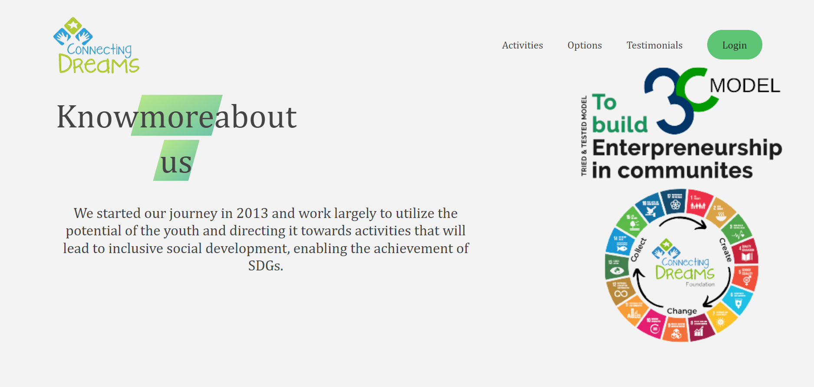
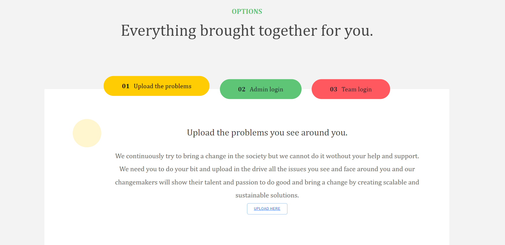
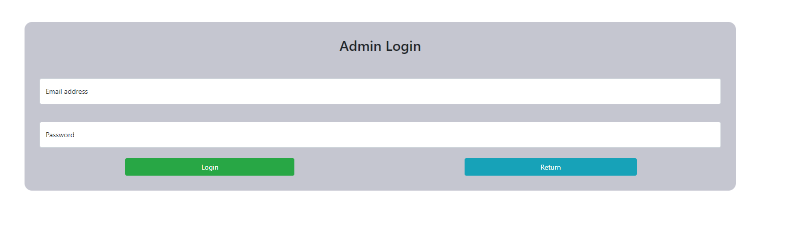

<center><h1 style="font-size:60px;"> Connecting Dreams Foundation </h1></center>

<hr style="border-top: 1px dashed white;border-bottom: 1px dashed white;">

<br>

## A Simple yet powerful platform for Hosting Hackathons for the needy.


<br>

## Basic Overview
<br>
Our Platform will Help the Communities in need to upload videos and get the most feasible solution for their problems by the help of the DreamMakers, those who are willing to solve the problem in most feasible way by their knowledge and using modern day technology.

<br>
<hr style="border-top: 1px dashed white;border-bottom: 1px dashed white;">
<br>

## Technologies Used : <br>

Frontend<br>


<br>
Backend<br>

<br>
Database<br>

<br>

<br>
<hr style="border-top: 1px dashed white;border-bottom: 1px dashed white;">
<br>

## How to get the code

Open the folder you want to clone git repo in command prompt
### You Could get the code by using the following command:
```
git clone https://github.com/cfghyd22/team-11.git
```
Now Code is on your machine.

The Whole project is divided into 2 parts<br>
1. Frontend<br>
Now follow the steps below to setup the frontend
* go to the folder where you cloned the code then follow the steps below
```
    cd team-11
    cd client
    npm install
```
1. Backend<br>
Now follow the steps below to setup the backend
* go to the folder where you cloned the code then follow the steps below
```
    cd team-11
    cd backend
    pip install -r requirements.txt
```

<br>
<hr style="border-top: 1px dashed white;border-bottom: 1px dashed white;">
<br>

## How to Run the project

1. Frontend<br>
Now follow the steps below to start the frontend application
* Go to the folder where you cloned the code then follow the steps below
```
    cd team-11
    cd client
    npm install
    nom start
```
1. Backend<br>
Now follow the steps below to start the backend application
* Go to the folder where you cloned the code then follow the steps below
```
    cd team-11
   * Install pip- Open command prompt and enter following command-
        * python -m pip install -U pip
   * Install virtual environment- Enter following command in cmd-
        * pip install virtualenv
   * Create a virtual environment by giving this command in cmd-
        * virtualenv env_site
   * Change directory to env_site by this command-
        * cd env_site
   * Go to Scripts directory inside env_site and activate virtual environment- 
        * cd Scripts activate
   * Return to the env_site directory-     cd ..
   * Install Django. 
    * pip install django
   * pip install -r requirements.txt
   * cd backend
   * Start the server- Start the server by typing following command in cmd-
        * python manage.py runserver
   * To check whether server is running or not go to web browser and enter http://127.0.0.1:8000/ as url.
```

<br>
<hr style="border-top: 1px dashed white;border-bottom: 1px dashed white;">
<br>


## How To use this site?

### For the Communities in need
1. Please Visit the Home and Click on the Upload Button.
2. The Link Redirect you to a gdrive folder where you can upload the video.

### For the DreamMakers
1. Please Visit the Home and Click on the Team Login Button.
2. The Link will redirect you to team login portal
3. Enter Your Email ID and Password For Registration and Logging in your Team Page.
4. You will be redirected to your Team Page.
5. Now Please Enter the Team Name and the Team Description.
6. Later On the same page you can set the priority of the problem statement available.
7. Now After selection the upload ppt button will be activated and you can upload the ppt file.
8. Now after ppt selection your mentors will connecto to You and discuss further roadpath.


### Program Admins

1. Please Visit the Home and Click on the Admin Login Button.
2. The Link will redirect you to admin login portal
3. Enter Your Email ID and Password For Logging on your Dashboard.
4. Now You could upload the files and case study for the hackathon.


<br>
<hr style="border-top: 1px dashed white;border-bottom: 1px dashed white;">
<br>

## Demo
Home Page
<br>
<br>

<br>
<br>
Login Dialog
<br>
<br>

<br>
<br>
Admin Login Page
<br>
<br>


<hr style="border-top: 1px dashed white;border-bottom: 1px dashed white;">
<br>

## More Features will be added soon.
<br>
<hr style="border-top: 1px dashed white;border-bottom: 1px dashed white;">
<br>
